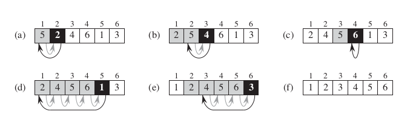

# Insertion Sort

## How?

- This is basically how we sort a deck of cards in our hands
- Pick second card from the beginning of the pile
- Compare it to previous card, is it in correct position?
- If it already is, leave it there
- If it's not, swap the card
- Pick the third card, compare it with second card, swap or not?
- Compare it with first card, swap or not?
- Pick fourth card, do the same fucking thing
- Again and again until it reaches the end
- Here is for illustration:

## Notes
- Efficient for small number of cards
- Simple and intuitive

